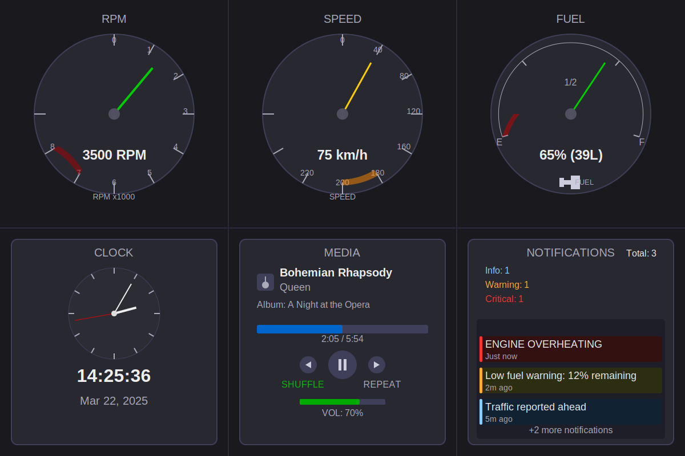

# Car HMI Digital Cluster Simulator

A Python-based emulator for car dashboard displays and interfaces that simulates various gauges and information systems found in modern vehicles.

## Layout



## Overview

This emulator creates a realistic car Human-Machine Interface (HMI) with dynamic gauges and information displays. It's designed for:

- Testing dashboard UI components
- Demonstrating vehicle interface designs
- Learning about automotive HMI development
- Experimenting with new dashboard layouts and features

## Features

- **Realistic Gauges**
  - RPM gauge with redline indication
  - Speed gauge with digital readout
  - Fuel gauge with low-fuel warning

- **Information Displays**
  - Real-time clock (analog and digital)
  - Media player with track information
  - Vehicle notifications system

- **Realistic Data Simulation**
  - Engine behavior modeling (idle, acceleration, deceleration)
  - Vehicle speed patterns
  - Fuel consumption
  - Media playback
  - Time-based notifications

- **Modular Architecture**
  - Socket-based communication between components
  - Independent data emulators for each component
  - Extensible component system

## Getting Started

### Prerequisites

- Python 3.7+
- Pygame 2.0+

### Installation

1. Clone this repository:
   ```bash
   git clone https://github.com/dejitaru-jin/Car-HMI-Digital-Cluster-Simulator
   cd car-hmi-emulator
   ```

2. Install required packages:
   ```bash
   pip install pygame
   ```

### Running the Emulator

Run the main application:
```bash
python main.py
```
## Key Controls

- **ESC**: Exit the application

## Architecture

The emulator uses a client-server model where:
- Each dashboard component (RPM gauge, speed gauge, etc.) is a client
- Each data source runs as a server on a different port
- Components connect to data sources via sockets

This architecture allows for:
- Independent data generation
- Realistic simulation
- Potential future connection to real vehicle data sources

## Project Structure

```
car-hmi-emulator/
├── main.py                    # Main application entry point
├── core/                      # Core framework components
│   ├── component.py           # Base component class
│   ├── constants.py           # Global constants and settings
│   └── utils.py               # Utility functions
├── components/                # UI components
│   ├── gauges/                # Dashboard gauges
│   │   ├── rpm_gauge.py       # RPM gauge component
│   │   ├── speed_gauge.py     # Speed gauge component
│   │   └── fuel_gauge.py      # Fuel gauge component
│   ├── info/                  # Information widgets
│   │   ├── clock_widget.py    # Clock display
│   │   ├── media_widget.py    # Media player display
│   │   └── messages_widget.py # Notifications display
│   └── platform/              # Platform integration
│       ├── data_source.py     # Data source connector
│       └── emul/              # Data emulators
│           ├── data_emulator_base.py      # Base emulator
│           ├── rpm_emulator.py            # RPM data generator
│           ├── speed_emulator.py          # Speed data generator
│           ├── fuel_emulator.py           # Fuel data generator
│           ├── clock_emulator.py          # Clock data provider
│           ├── media_emulator.py          # Media data simulator
│           └── messages_emulator.py       # Messages generator
└── assets/                    # Static resources
    ├── images/                # Image resources
    ├── fonts/                 # Font files
    └── documents/             # Documentation
```

## Extending the Emulator

The modular architecture makes it easy to add new components:

1. Create a new emulator in `components/platform/emul/`
2. Create a corresponding UI component
3. Add the component to the layout in `constants.py`
4. Initialize the component in `main.py`

See the existing components for examples.

## License

This project is licensed under the GPL 2.1 License - see the LICENSE file for details.

## Acknowledgments

- The Pygame community for the excellent graphics library
- Automotive UI designers for inspiration
